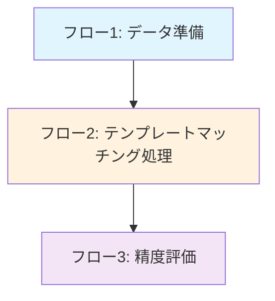

フロー1：データ準備
- CSVファイルの読み込み
- work_predict_label=1のデータを抽出
  - 特徴量による分類で欠陥の可能性があるとされたデータのみを使用
- 欠陥データ（defect_label=1）からテンプレート画像を作成
  - 画像パスの取得（defected_image_path + defect_image_orig）
  - 画像の読み込み
- 画像の前処理
  - グレースケール化
  - サイズチェックとリサイズ（必要な場合）

フロー2：テンプレートマッチング処理
- 入力画像の準備
  - 画像の読み込み
  - グレースケール化
- テンプレートマッチング実行
  - すべてのテンプレートに対してマッチング計算
  - cv2.matchTemplateでマッチングスコア計算（TM_CCOEFF_NORMED使用）
  - 最大マッチングスコアの取得
- 欠陥判定
  - 閾値（0.95）との比較
  - 閾値以上：欠陥あり（1）
  - 閾値未満：欠陥なし（0）

フロー3：精度評価
- 欠陥ごとの評価
  - 混同行列の作成（TP, FP, TN, FN）
  - 欠陥検出率 = TP/(FN+TP)
    - 目標：100%（見逃しゼロ）
  - 誤検出率 = FP/(TN+FP)
    - 目標：最小化
- ワークごとの評価
  - work_idでグループ化
  - ワーク単位の予測値生成
    - 一つでも欠陥判定（1）があれば欠陥ワーク（1）
    - すべて非欠陥判定（0）なら非欠陥ワーク（0）
  - ワーク単位の混同行列作成（work_TP, work_FP, work_TN, work_FN）
  - 見逃し率 = work_FN/(work_FN+work_TP)
  - 見過ぎ率 = work_FP/(work_FP+work_TN)
- 結果の出力
  - 各指標の数値表示
  - 判定結果の保存
