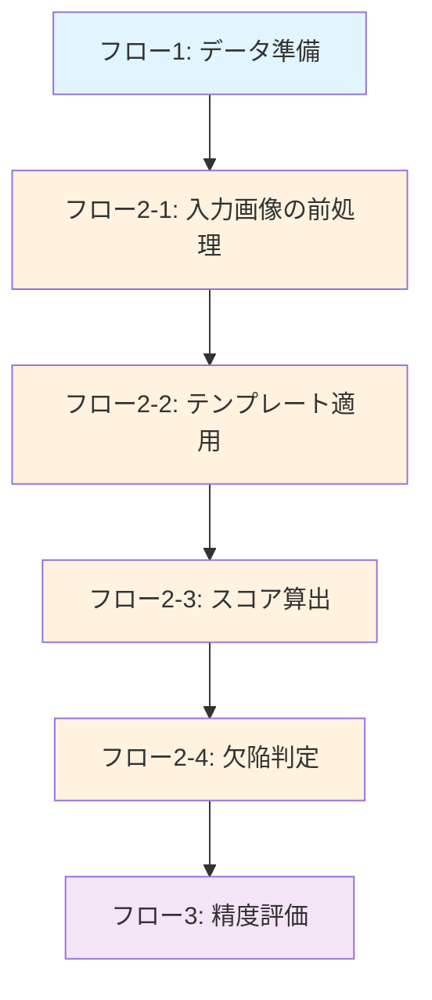

フロー1：データ準備
- work_predict_label=1のデータを抽出
- 欠陥データ（defect_label=1）からテンプレート画像を作成
- 画像の読み込みと前処理（グレースケール化）

フロー2：テンプレートマッチング処理
- フロー2-1：入力画像の前処理
  - 画像の読み込み
  - グレースケール変換
  - サイズチェックとリサイズ（必要な場合）

- フロー2-2：テンプレート適用
  - 各テンプレートとのマッチング実行
  - cv2.matchTemplateによる類似度計算（TM_CCOEFF_NORMED）
  - テンプレートサイズと入力画像サイズの調整

- フロー2-3：スコア算出
  - 各テンプレートとのマッチングスコア計算
  - 最大マッチングスコアの取得
  - マッチング位置の特定

- フロー2-4：欠陥判定
  - 最大スコアと閾値（0.95）の比較
  - 欠陥/非欠陥の判定
  - 判定結果の保存

フロー3：精度評価
- 欠陥ごとの精度指標算出
  - 欠陥検出率 = TP/(FN+TP)
  - 誤検出率 = FP/(TN+FP)
- ワークごとの精度指標算出
  - ワーク内に一つでも欠陥判定があれば欠陥ワークと判定
  - 見逃し率 = work_FN/(work_FN+work_TP)
  - 見過ぎ率 = work_FP/(work_FP+work_TN)
- 結果の集計と表示
